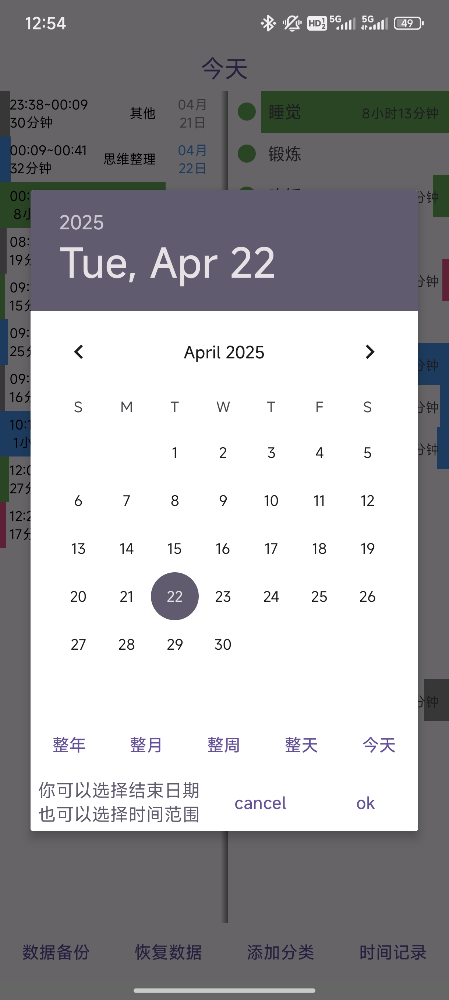
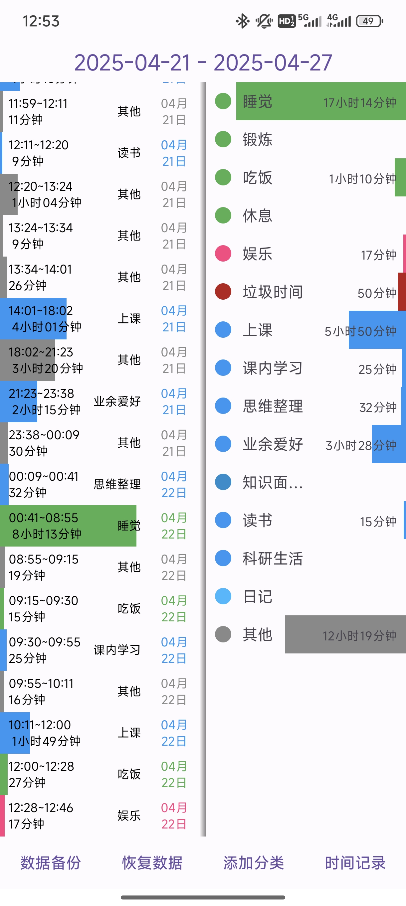
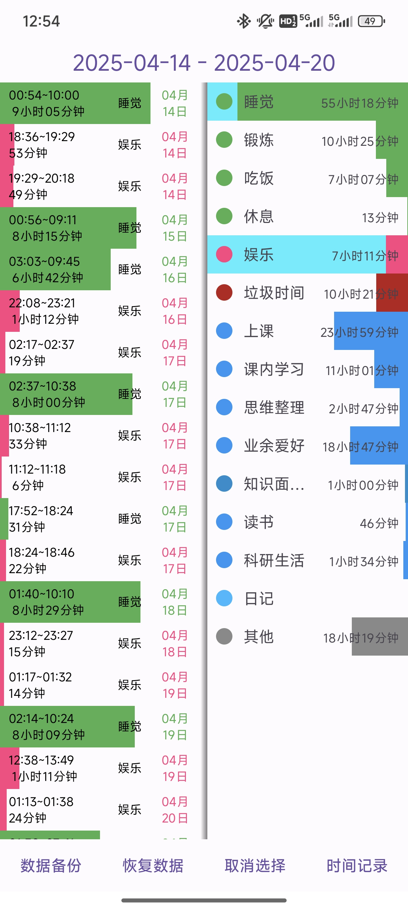
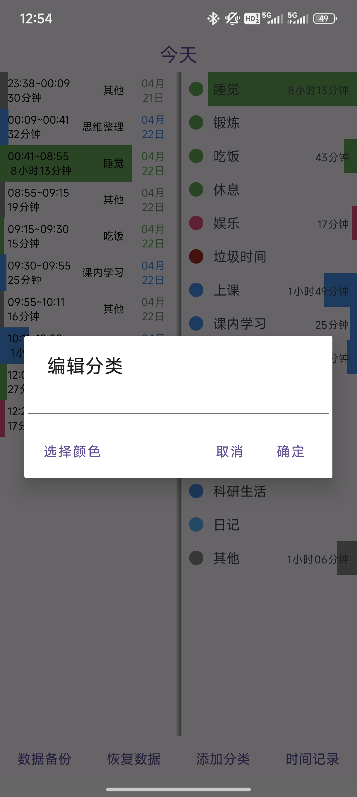
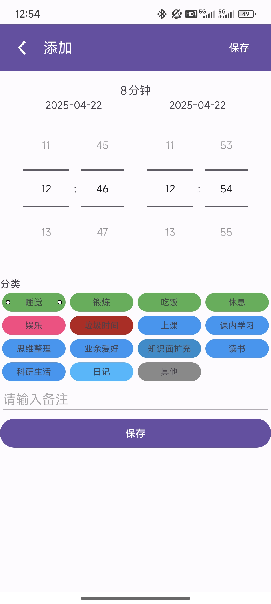
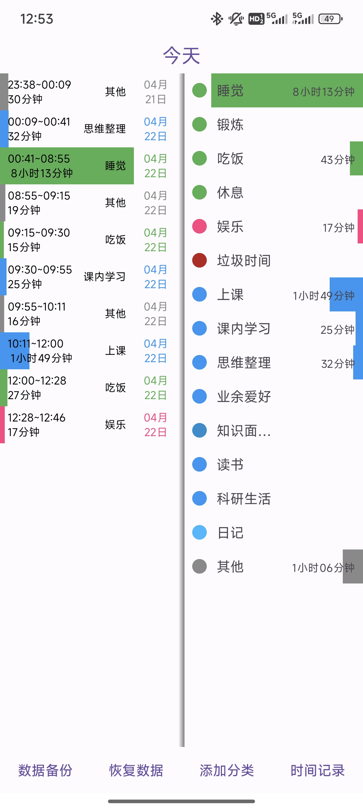

# 写在前面

该项目是一个干净无广告，开源，免费的时间记录安卓应用，不用注册，联网，支持本地数据备份。主要功能是记录日常生活在各种事物上所花的时间。

   
  
  
  
  
  
  

<!-- 
 
 

 -->

<!--           -->

软件的主页面分为两栏，左边为事件记录条目，右边为分类。
上方为时间栏，点击时间栏可以选择显示的时间范围。
点击事件记录条目可以进入事件记录详情页面，可以编辑或删除事件记录。
左滑分类快捷记录，右滑分类进行选中筛选。
点击分类可以进入分类详情页面，可以编辑或删除分类。

# 记录功能

## 时间记录功能

点击按钮 `时间记录` 打开时间记录页面，选择起止时间和时间分类，填写备注，点击保存即可。

## 滑动快捷记录
按住一个分类左滑可以给相应的分类添加一条记录，记录的时间会自动设置为为上一条记录的结束时间到当前时间，备注为空，如果没有记录或者上一条记录的结束时间到当前时间的时间差大于24小时，则开始时间自动设置为当天的0点。

# 分类管理功能

## 添加分类

点击添加分类按钮，输入分类名并选择分类显示颜色，点击确定即可。

## 编辑分类

点击右侧页面中的分类可以进入分类详情页面，可以编辑或删除分类。

# 数据备份和恢复

点击 `数据备份` 按钮可以选择一个位置导出包含所有记录的文件。点击 `恢复数据` 按钮可以选择自己导出的文件恢复其中的数据。

# 记录查询

## 时间范围选择

APP默认显示当天的的记录，如果需要查询指定日期范围的记录，可以点击上方时间栏修改当前显示的时间范围。点击时间栏的左侧选择起始日期，点击时间栏的右侧选择结束日期。

## 分类筛选

按住APP右侧的任意分类右滑可以进入分类筛选模式，只会显示被选中的分类，该模式下连续右滑两个分类可以选中这两个分类之间的所有分类，点击分类可以反转该分类的选中状态。点击 `取消选择` 按钮或者手动取消所有分类的选中状态后回到正常显示模式。
